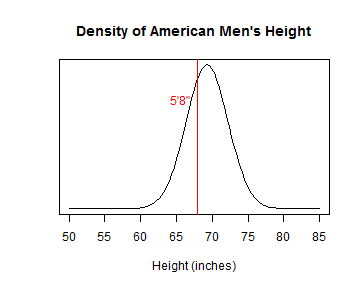

## How Tall are You?

Ever wonder how your height compares to the height of people in the United States?

The Height Comparison application allows you to enter your height.

It will then tell you what percentage of American men and women you are taller than.

Let's see an example of comparison to men's height...

--- .class #id 

## How It Works: Comparison Calculation

Given a height of 5 feet and 8 inches, compare the height to that of American men.


```r
f <- 5; n <- 8; h <- 12 * f + n
mmean <- 69.3; msd <- 2.92
result <- function( h, mean, sd ) {
  round(
    100*pnorm( h , mean , sd ) ,
    digits=1
  )
}

paste( "You are taller than about " ,
       result( h , mmean , msd ) ,
       "% of American men" , sep=""
)
```

```
## [1] "You are taller than about 32.8% of American men"
```

---

## How It Works: Density Plot

The application also shows the given height on a plot of the density of men's height.


```r
plot( function(x) dnorm(x, mmean, msd), 50, 85, ylab="", yaxt="n",
      xlab="Height (inches)", main="Density of American Men's Height" )
abline( v=h, col="red" )
text( h , 0.75*dnorm(mmean, mmean, msd), paste( f,"'", n,"\"", sep=""), pos=2, col="red" )
```



---

## Source of Height Statistics

Means and standard deviations of height of American men and women used by this 
application are taken from the paper ['Is Human Height Bimodal?'](http://www.biostat.jhsph.edu/bstcourse/bio751/papers/bimodalHeight.pdf) by Schilling, 
Watkins, and Watkins, published in The American Statistician, August 2002, 
Vol. 56, No. 3.  

The means and standard deviations were calculated from data 
published by the U.S. National Health and Nutrition Examination Survey for 
subjects in the 20-29 age bracket and were found to follow the normal 
distribution.  

<table border=1 style='width:100%'>
 <caption>Table: Mean and SD of Height in Inches</caption>
 <tr><th></th><th> Mean </th><th> SD </th></tr>
 <tr><td> Men </td><td> 69.3 </td><td> 2.92 </td></tr>
 <tr><td> Women </td><td> 64.1 </td><td> 2.75 </td></tr>
</table>
